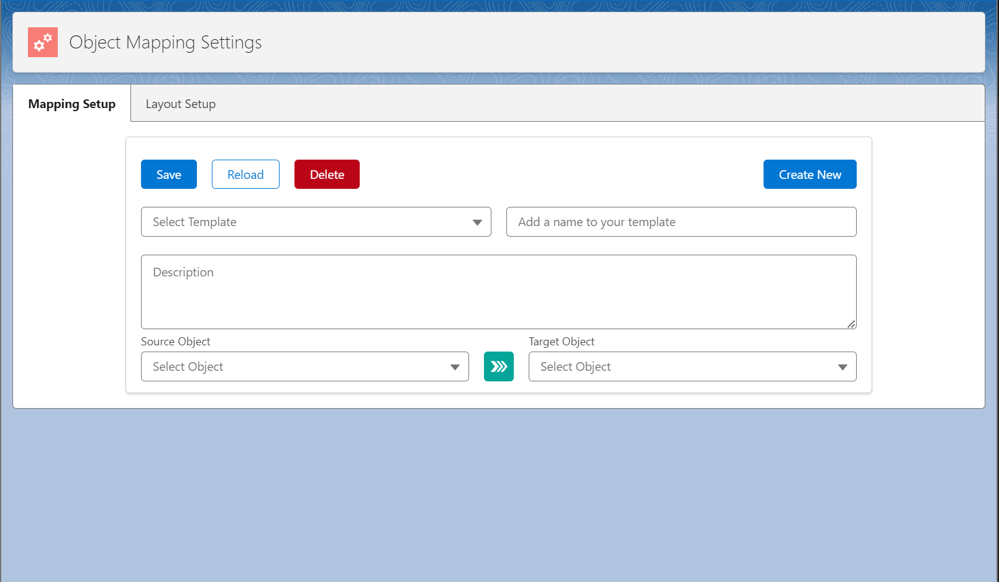
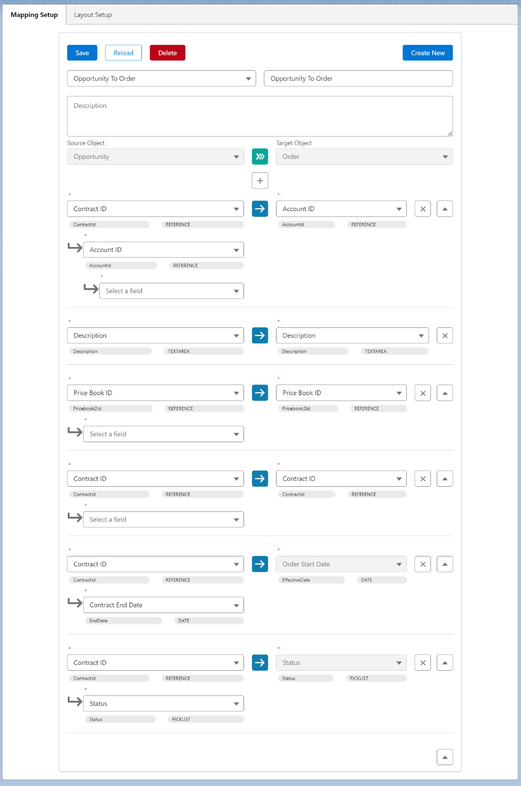
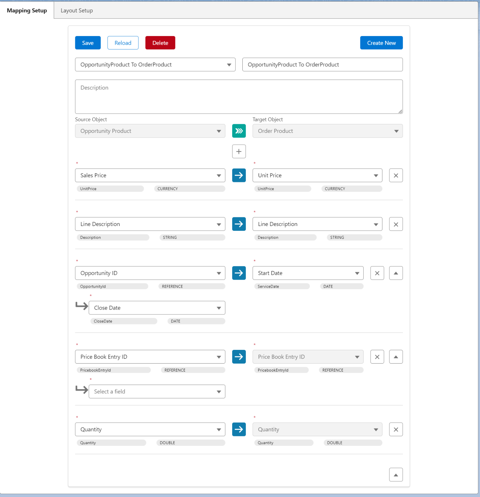
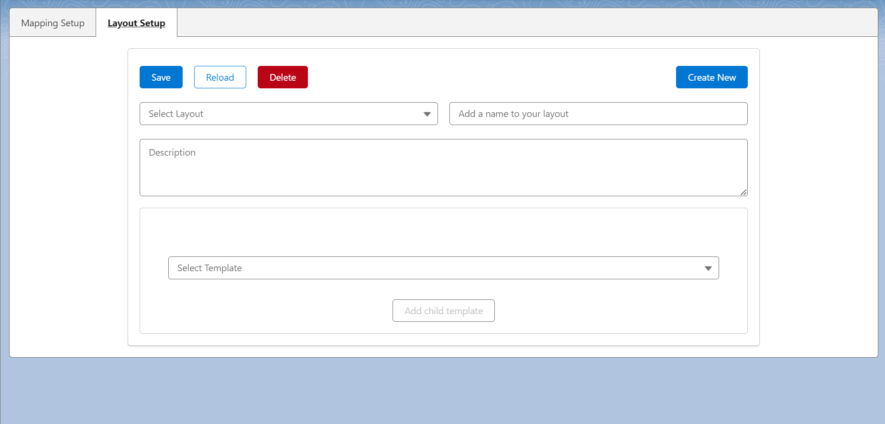
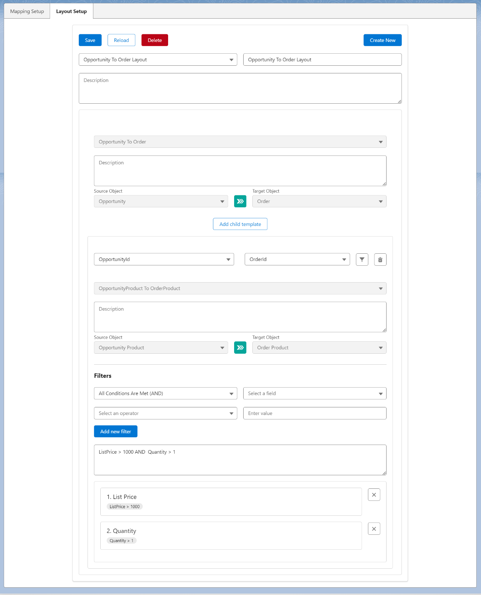
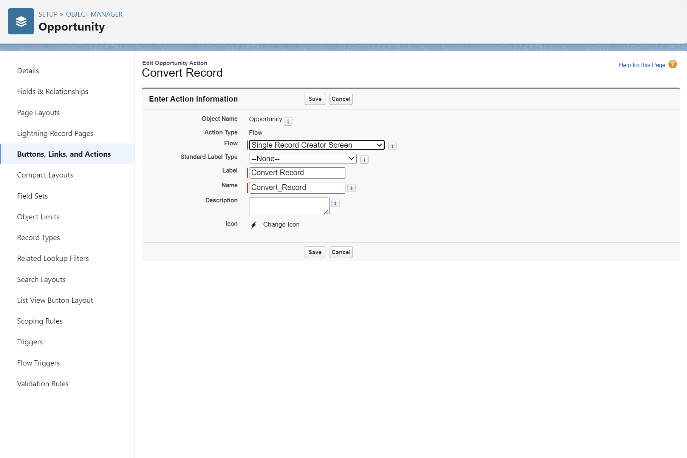
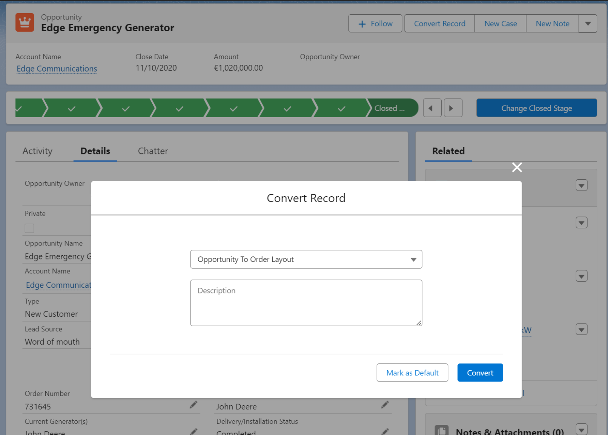
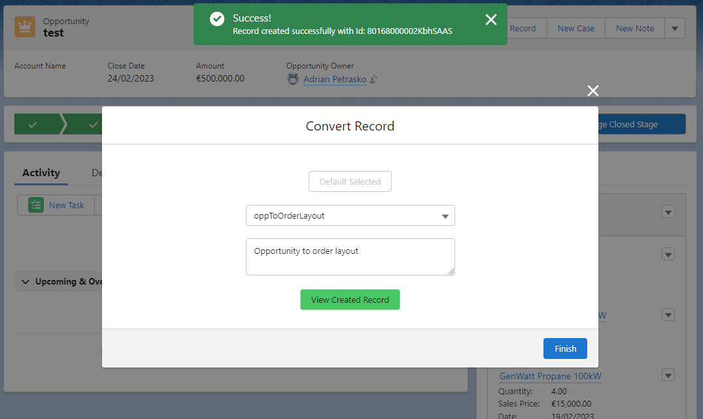

# Object Conversion Tool
Salesforce SObject Conversion Tool for converting records efficiently between different object types with providing a user-friendly interface for configuring the conversion.
## Object Mapping Setup Tool
The Mapping Setup Tool for setting up custom and standard 
object field mappings for object conversion can provide a user-friendly interface
for configuring the mapping of fields between different objects.

- The LWC could include features such as add, edit and delete field mappings, 
and the ability to save, load, reload and delete the mapping configurations.
- It allows to select the source and target objects and fields and to traverse up to 5 levels of relationships.

In the example below the Opportunity object type is selected as the source object and the Order object type is selected as the target object.

In the example below the Opportunity Product object type is selected as the source object and the Order Product object type is selected as the target object.

## Object Mapping Layout Setup Tool
The Mapping Layout Setup Tool for setting up predefined layouts for object conversions that can be selected by the user before the conversion.
- It can be used to define the parent and child object mappings in any combination for the conversion for the selected object type.
- The LWC could include features such as add parent and child mapping relations, and the ability to save, load and delete the layout configurations. 
- Also provide to set up filters for child mappings.

- In the example below the parent mapping is set up for the Opportunity object and the child mapping is set up for the OpportunityLineItem object.
- The Opportunity in set up to convert to Order and the OpportunityLineItem is set up to convert to OrderItem.

- To use the layout setup, you have to create an action on the selected object with using the Screen Flow named Single Record Creator Screen:

- Then put the action to the page layout of the selected object and you can use the button to convert the actual record selecting the object mapping layout.
- It is possible to mark the selected mapping layout as default that will be selected automatically when you click on the action.

- After clicking the Convert button if the conversion is successful, you can view the created records with all the related child records on it by clicking the View Created Record button.

