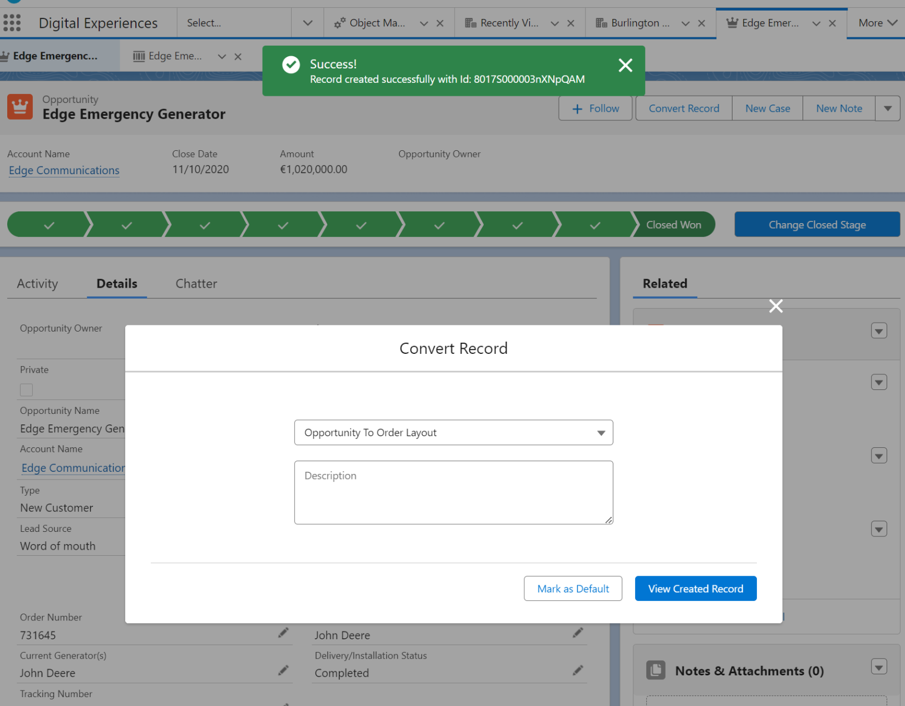

# Object Conversion Tool

## Object Mapping Setup Tool
The Mapping Setup Tool for setting up custom and standard 
object field mappings for object conversion can provide a user-friendly interface
for configuring the mapping of fields between different objects.

- The LWC could include features such as add, edit and delete field mappings, 
and the ability to save, load, reload, clear and delete the mapping configurations.
- It allows to select the source and target objects and fields and to traverse up to 5 levels of relationships.

## Object Mapping Layout Setup Tool
The Mapping Layout Setup Tool for setting up predefined layouts for object conversions that can be selected by the user before the conversion.
- It can be used to define the parent and child object mappings in any combination for the conversion for the selected object type.
- The LWC could include features such as add, edit and delete the parent and child mappings,
and the ability to save, load and clear the layout configurations. 
- Also provide to set up filters for child mappings.

- In the example below the parent mapping is set up for the Opportunity object and the child mapping is set up for the OpportunityLineItem object.
- The Opportunity in set up to convert to Order and the OpportunityLineItem is set up to convert to OrderItem and TestChild custom objects.

- To use the layout setup, you have to create an action on the selected object with using the Screen Flow named Single Record Creator Screen:

- Then put the action to the page layout of the selected object and you can use the button to convert the actual record selecting the object mapping layout.
- It is possible to mark the selected mapping layout as default that will be selected automatically when you click on the action.

- After clicking the Convert button if the conversion is successful, you can view the created record with clicking the View Created Record button.

- Limit usage of the above record conversion (1 parent and 2 child mappings):

